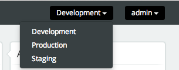
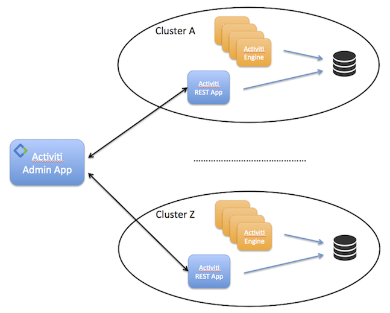
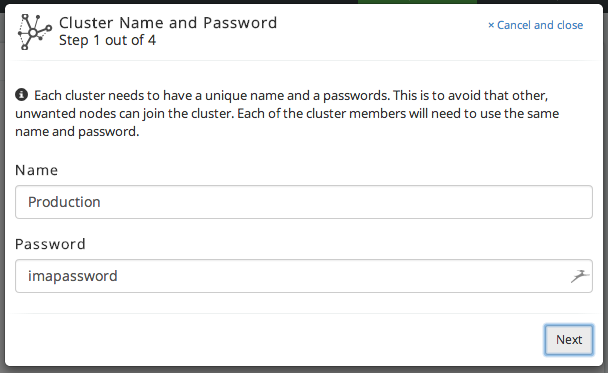
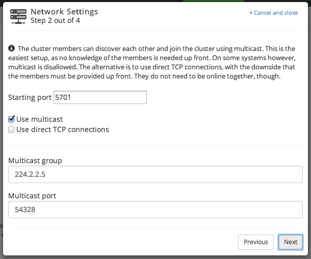
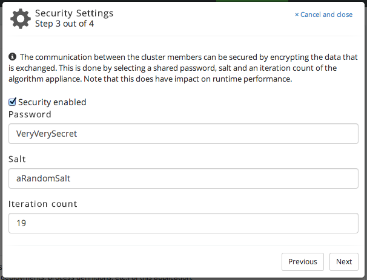
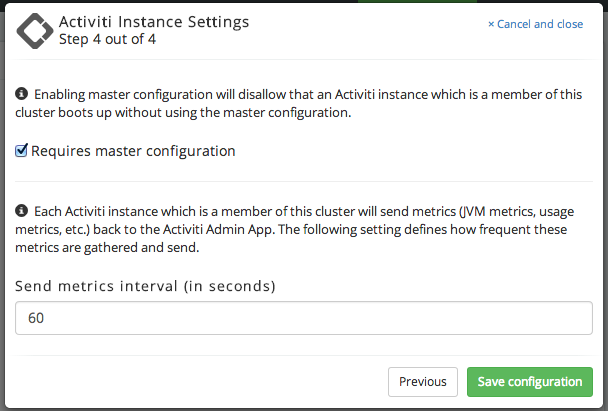
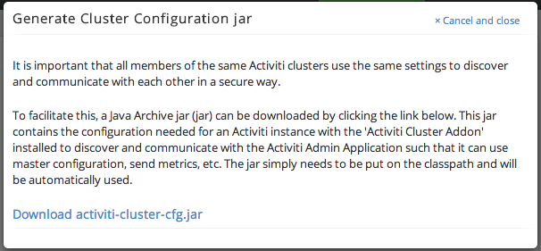
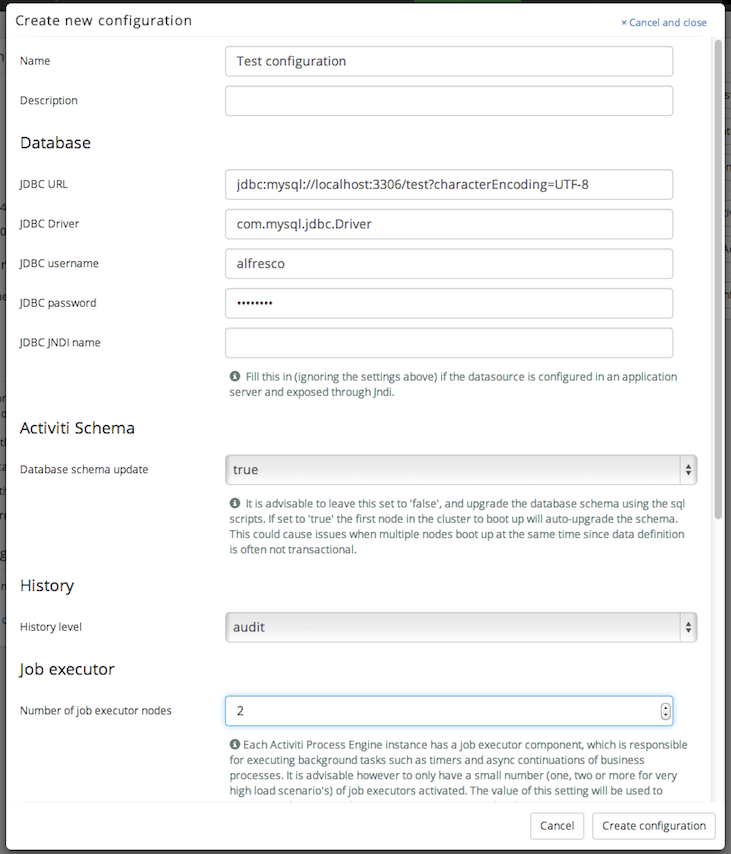
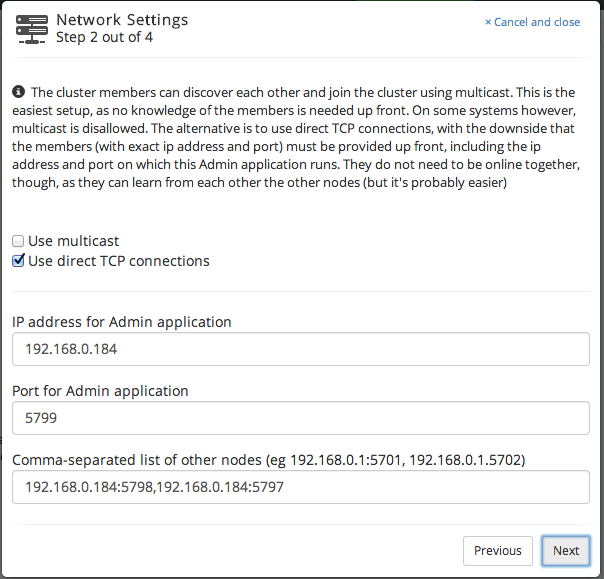
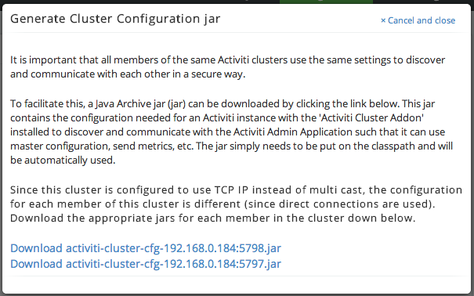

= Alfresco Activiti Enterprise Technical User Guide

== Introduction

This user guide contains the specific details around the features and functionality in Alfresco Activiti Enterprise. These capabilities are build on top of http://www.activiti.org[Activiti Community BPM Platform], which means that everything that is described in the http://activiti.org/userguide/index.html[Activiti Community User Guide], blogs or online articles also applies to the Enterprise version of Activiti. Note that this is a technical user guide. As such, it describes technical topics, such as setup and configuration rather than usage.

In this user guide, the following Enterprise-only features are described:

* *The Activiti Admin Application* : this is an enterprise-only application that can be used to manage the data for an Activiti engine (or cluster of engines). It also is used for cluster configuration and monitoring.
* *Cluster configuration and monitoring* : the Activiti Enterprise engine is cluster-enabled in the sense that, together with the Activiti Admin Application, one can configure and monitor a cluster (or multiple different clusters) through a user interface. The clustered engines will use the same configuration and will report metrics and status back to the Admin Application where they are visually displayed.

== Activiti Admin Application

=== Installation

The Activiti Admin Application is distributed as a regular _WAR_ (Web Application ARchive) file that can be dropped in any Java web container (minimally only needs Servlets). Supported web containers are

* Tomcat 7
* Jetty 9

The Activiti Admin Application works with JDK 7+.

It uses a relational database for storing data. Following databases are supported:

* MySQL 5.5+
* Postgres 9.0+
* Oracle 10g+
* Microsoft SQL Server 2012+
* H2 database

Simply drop the _activiti-admin.war_ file into the web container and start the web container. To make the application use your database, you must

* copy the correct JDBC database driver to the classpath of the web application
* create a property file called *activiti-admin.properties* that *must be on the classpath* of the web application. The properties must point to the correct environment settings. Also not that besides the database connection properties, also the URL to the  Activiti Modeler is set here.

=== Configuration for MySQL

Example configuration for Mysql:
----
datasource.datasourceclassname=com.mysql.jdbc.jdbc2.optional.MysqlDataSource
datasource.url=jdbc:mysql://localhost:3306/activiti?characterEncoding=UTF-8
datasource.username=activiti
datasource.password=activiti

modeler.url=https://activiti.alfresco.com/rest/app/
----

=== Configuration for Postgres

Example configuration for Postgres:

=== Configuration for Oracle

Example configuration for Oracle:

=== Configuration for Microsoft SQL Server

Example configuration for Microsoft Sql Server:

=== Configuration for H2

Example configuration for H2:
----
datasource.datasourceclassname=org.h2.jdbcx.JdbcDataSource
datasource.url=jdbc:h2:tcp://localhost/activiti
datasource.username=sa
datasource.password=
hibernate.dialect=org.hibernate.dialect.H2Dialect

modeler.url=https://activiti.alfresco.com/rest/app/
----

== Cluster Configuration and Monitoring

The Activiti Admin Application can show the process data and manage the configuration of multiple clusters. In this context a _cluster_ is a certain number of Activiti engines that logically belong together. Note that this does not relate to the way that these engines are architecturally set up: embedded, exposed through REST, with or without a load balancer in front, etc. 

=== Architecture

Multiple clusters can be configured and managed through the Activiti Admin Application. This is visible in the drop down in the top-right corner:

*Each of the engines in a cluster should point to the same database schema*. To access the data of a cluster, the Admin Application uses one Activiti REST application per cluster (to avoid direct access to the database from the Activiti Admin Application). This is a web applicaton also distributed as a _WAR_ file. It is configured in a similar way as the Admin Application with a file called _activiti-rest.properties_ on its classpath. To point it to the correct database, change the properties accordingly (the settings follow the same pattern as the http://activiti.org/userguide/index.html#databaseConfiguration[Activiti engine database configuration]:

----
db=h2
jdbc.driver=org.h2.Driver
jdbc.url=jdbc:h2:tcp://localhost/activiti
jdbc.username=sa
jdbc.password=
----

As shown on the picture below, any cluster can consist of multiple Activiti engine nodes (pointing to the same database schema), the data that is managed in the Activiti Admin Application is fetched through an Activiti REST application only.

The REST endpoint for each cluster can be configured through the Admin application. Simply change the settings for the endpoint on the _Configuration > Engine_ page while the cluster of choice is selected in the drop down in the top-right corner. The current endpoint configuration is also shown on this page:

image::images/endpoint-config.png[align="center"]

=== Cluster configuration

[[clusterConfig]]A cluster is a set of Activiti engines (embedded, standalone or mixed) which logically form a named group. A simple example could be three clusters for 'development', 'staging' and 'production'. These engines are also referred to as 'nodes' in this user guide and in the Admin application.

The way these nodes are grouped technically is by using the distributed capabilities of the Hazelcast framework (http://hazelcast.org/). In the logging, you will see log lines passing by of Hazelcast data structures that are being constructed and managed for each of the clusters. More specifically, nodes in the same cluster will find each other by using the same multicast setting or having the same TCP/IP configuration. Don't worry, configuring these settings can all be defined through the Admin application user interface.

As an example, let's create a new cluster called 'Production' and add three Activiti REST applications to it (the explanation here could be interchanged with embedded Activiti engines too). First of all we're going to create the cluster configuration on the Activiti Admin application side. Go to the _Configuration > Engine_ page and click the _'Create new cluster configuration'_ button. Choose a cluster name and password. Nodes that don't know this password can't join the cluster, even if they would know the correct network settings.

Next, we need to choose the network settings so the nodes can find each other. In the picture below, we used multicast and changed another ip address and port:

In the next wizard page, the security settings can be filled in. This is optional, but enabling does have an impact on runtime performance.

In the last page, enable the master configuration (we'll come back to that later) and set the time interval (in seconds) in which the nodes will send metrics and status updates to the Admin application:

When clicking 'Save configuration', the new cluster configuration is created, and the user interface will now automatically have switched to the 'Production' cluster.

Now, we need to make sure the nodes of the cluster can find each other. To do this, go to the _'Configuration > Engine'_ page, and click the _'Generate cluster config jar'_ button. A popup as shown below will be shown which allows to download a jar containing a file called _'activiti-cluster.properties'_. It's not necessary to use this jar, as long as there is a file with this name on the classpath. The jar is just a convience.

Drop the jar in the appropriate place (for Tomcat this is for example the _lib_ folder of the webapp or the global _lib_ folder) and start the Server. The Activiti Enterprise Engine will notice the _activiti-cluster.properties_ on the classpath and activate the cluster config capabilities. However, since we mandated that every node in the cluster should use the 'master configuration', you should see an exception happening which looks as follows:

----
java.lang.RuntimeException: This Activiti instance is configured to only boot up when a valid master configuration is available.
----	

Which is as expected. We'll now dive into the master configuration.

=== Master Configuration
	
[[masterConfiguration]]When a cluster is configured (see <<clusterConfig, cluster configuration section>>), you can choose to enable 'master configuration' for the nodes. When this is enabled, the nodes in the cluster use the same shared configuration for creating the Activiti Process Engine. This is way easier than manually managing the configuration files for the engines.

A 'master configuration' is defined in the _'Configuration > Engine'_ page. Note that the buttons there state 'Add configuration', because multiple master configurations can be defined, and *one configuration* is selected to be the master configuration for the current cluster. 

If we continue the example from the <<clusterConfig, cluster configuration section>>, we will now try to get our nodes to use the master configuration. As shown in the screenshot below, the nodes will use a MySQL database, use audit history level and we'll aim for two job executors among the nodes (more on that later). Note that settings which are not filled in will (except for database connection properties) default to a reasonable setting.

Start now the web container with the cluster-enabled Activiti engine running in it. After a while, the node has successfully joined the cluster. In its logging, it is clear that the master configuration is used to boot up the Activiti engine:

----
INFO  com.activiti.addon.cluster.ActivitiClusterConfigurator  - Master configuration enabled. Changing local configuration to master configuration.
INFO  com.activiti.addon.cluster.ActivitiClusterConfigurator  - JDBC url is changed to jdbc:mysql://localhost:3306/test?characterEncoding=UTF-8
INFO  com.activiti.addon.cluster.ActivitiClusterConfigurator  - JDBC driver is changed to com.mysql.jdbc.Driver
INFO  com.activiti.addon.cluster.ActivitiClusterConfigurator  - JDBC user name is changed to alfresco
INFO  com.activiti.addon.cluster.ActivitiClusterConfigurator  - JDBC password is changed (not shown for security)
INFO  com.activiti.addon.cluster.ActivitiClusterConfigurator  - DatabaseSchemaUpdate is changed to true
INFO  com.activiti.addon.cluster.ActivitiClusterConfigurator  - History is changed to audit
----

The 'Monitoring' tab in the Activiti Admin application (make sure the correct cluster is selected) now shows the new node in the cluster:

image::images/node-joined-cluster.png[align="center"]

New nodes that have the same cluster jar (or _activiti-cluster.properties_) on its classpath will join the node in a similar way while also using the same configuration.

=== Job Executor Nodes

One setting in the <<masterConfiguration, master configuration>> options is the 'Number of job executor nodes' setting. A Job Executor is a crucial component of an Activiti installation, as it is responsible for handling the timers and async continuations of processes (generically called 'jobs'). By default, every Activiti engine has the job executor component enabled. However, in a production environment this is not really advised: it would cause a lot of optimistic lockings (all job executor try to lock jobs first before executing them). Although this is not a problem, it does waste resources and hits the database more than necessary.

By setting the number of job executor nodes in a master configuration through the Admin application user interface, the Admin application will control the number of job executors that is running in the cluster. For example, suppose there is a cluster of five nodes and the 'number of job executor nodes' has been set to two. When these five nodes boot up, only on two nodes the job executor will be enabled. If these nodes would go down, the Admin application will enable the job executor component on another node in the cluster. This way, the Admin application will keep the job executor components consistent with the required setting.

=== Multicast configuration

[[multicastConfig]]Using multicast to let the nodes find each other is the easiest approach: you select a multicast ip address and port which all the nodes will use to broadcast to each other. In this configuration, the nodes can autodiscover each other with no prior knowledge of each other. This is also the default configuration when no specific choices are made during the cluster network config setup.

=== TCP/IP configuration

In some network environments, <<multicastConfig, multicast>> is disallowed for various reasons. Alternatively, TCP/IP can be used. The downside of this approach is that all the nodes must be listed with their ip address and port up front (note that the nodes can 'learn' this information from each other in theory, but we advise not to rely on this).

See the screenshot below for an example of the TCP/IP configuration, the format of the 'nodes list' follows the format defined by hazelcast as described at http://hazelcast.org/docs/3.1/manual/html-single/#ConfigTcpIp (ranges, etc).

Similar to multicast (altough multicast has *one jar* for each of the nodes), a jar can be generated. Do note that the jar is specific to the node and must be placed on the correct machine to function properly.

== Licensing

To use the enterprise features of Activiti, you need to put a valid license file in 

* the classpath of the Activiti engine
* the classpath of the Activiti REST endpoint used in a cluster
* the classpath of the Activiti Admin application

If the license file is not present, the process engine won't boot up or the Admin application will halt.

